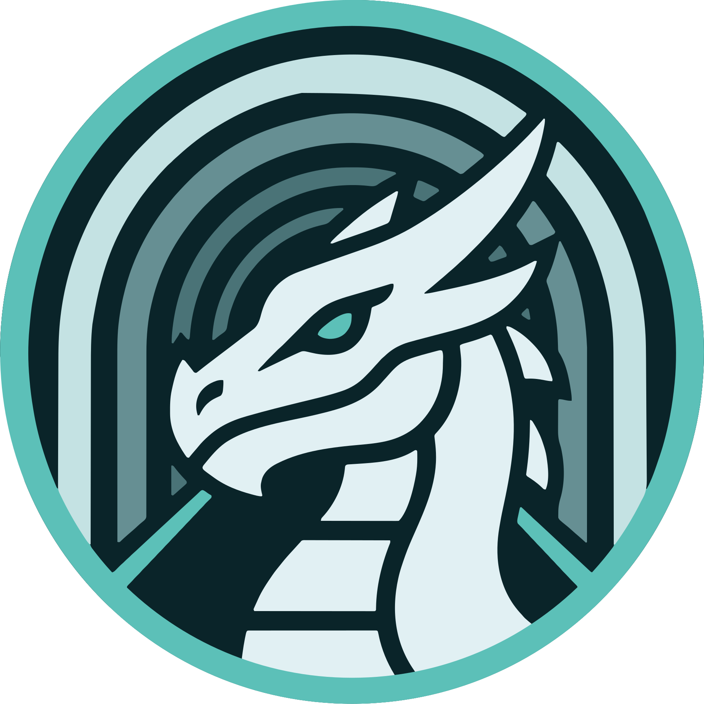
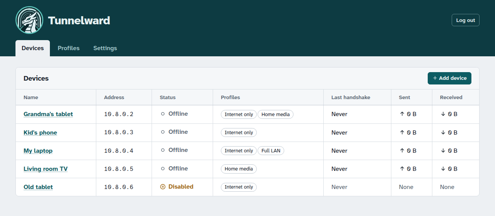
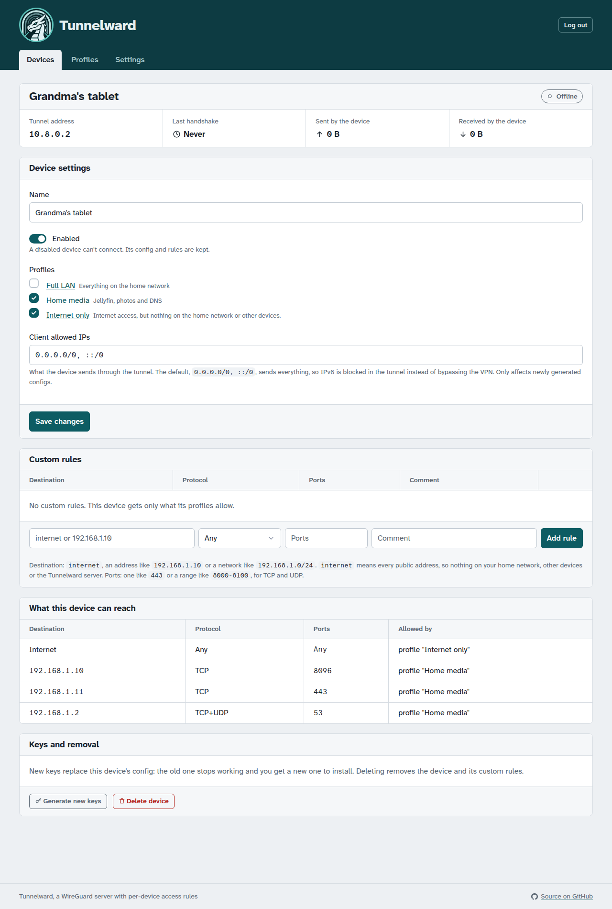

<p align="center">
  
</p>

<h1 align="center">Tunnelward</h1>

<p align="center">
  A small, self-hosted WireGuard server with per-device access rules, managed from a web UI.
</p>

<p align="center">
  <a href="https://github.com/ap-andersson/tunnelward/actions/workflows/test.yml"></a>
  <a href="LICENSE"></a>
  
</p>

> [!WARNING]
> **Tunnelward is in early development and has not been tested in a real deployment yet.**
> It has automated tests, including ones that send real traffic through WireGuard in throwaway
> network namespaces, but it hasn't been run on a real server with real devices over time.
> It controls access into your home network, so review the generated firewall rules
> (`docker exec tunnelward nft list table inet tunnelward`) and test from outside your network
> before relying on it.

> [!NOTE]
> **This project was written by Claude, an AI model by Anthropic**, working with
> [@ap-andersson](https://github.com/ap-andersson), who directed the design and decisions and
> reviewed the result. Treat it like any other young codebase: read it before you trust it.

Give your own laptop access to the whole home network, give a family member's phone internet access
through your home connection and nothing else, and let the TV box reach only Jellyfin. All from one
WireGuard server. It's a companion to the [TunnelVision](https://github.com/ap-andersson/tunnelvision)
desktop client.

The goal is a codebase small enough to read end to end, so you can trust what it does to your network.

<p align="center">
  
</p>

<details>
<summary>Device page screenshot</summary>
<br>

</details>

## Features

- **Devices**: add a device, scan the QR code or download the config. The private key is shown once
  and never stored.
- **Profiles**: reusable sets of rules, e.g. "Internet only" or "Home media". A device can have several.
- **Custom rules** per device on top of its profiles.
- **Default deny**: a device reaches only what its rules allow. That includes other devices, the LAN
  and the Tunnelward server itself.
- **Live status**: last handshake and traffic per device.
- **"What this device can reach"**: every device page lists exactly what it may access, and why.
- Light and dark theme.
- A single Docker container on a normal bridge network: one Go binary with SQLite inside, no external
  database.

## How access works

Every rule *allows* traffic from a device to a destination. There are no deny rules, so a device's
access is simply the sum of its profiles and custom rules, and removing a profile can only take
access away.

A rule has:

| Field       | Examples                                                   |
|-------------|------------------------------------------------------------|
| Destination | `internet`, `192.168.1.10`, `192.168.1.0/24`               |
| Protocol    | Any, TCP, UDP, TCP+UDP, ICMP                               |
| Ports       | empty (any), `443`, `8000-8100` (TCP and UDP only)          |

`internet` means every public address. It excludes private ranges (your LAN, other devices, Docker
networks) and the Tunnelward server, so "Internet only" really is internet only.

Example setup:

| Profile        | Rules                                                         |
|----------------|---------------------------------------------------------------|
| Internet only  | `internet` (created automatically)                            |
| Home media     | `192.168.1.10` TCP `8096` (Jellyfin), `192.168.1.2` TCP+UDP `53` (DNS) |
| Full LAN       | `192.168.1.0/24`                                              |

- Grandma's tablet: *Internet only* + *Home media*
- Kid's phone: *Internet only*
- Your laptop: all three

If you set a DNS server on your LAN in Settings (e.g. a Pi-hole), devices also need a rule that
allows reaching it, like the DNS rule above.

Devices route all their traffic through the tunnel by default (`0.0.0.0/0, ::/0`). Tunnelward is
IPv4 only. IPv6 traffic enters the tunnel and is dropped there instead of bypassing the VPN, and
apps fall back to IPv4.

## Requirements

- A Linux host with Docker and kernel WireGuard support (Linux 5.6+, e.g. Ubuntu 24.04).
- A UDP port forwarded from your router to the host (51820 by default).

Make sure the WireGuard kernel module is loaded on the host, now and after reboots:

```sh
sudo modprobe wireguard
echo wireguard | sudo tee /etc/modules-load.d/wireguard.conf
```

## Install

1. Get [`compose.yaml`](compose.yaml) onto your server, e.g. in a `tunnelward` directory.
2. Change `192.168.1.5` in the admin UI port to **your server's LAN IP**, so the UI is only reachable
   on your home network.
3. Start it. Docker creates the `data` folder next to `compose.yaml`; let it, rather than creating
   the folder yourself (see [Troubleshooting](#troubleshooting)).

   ```sh
   docker compose up -d
   ```

   To build the image yourself instead of pulling it, clone this repository, uncomment `build: .`
   in `compose.yaml` and run `docker compose up -d --build`.

4. **Right away**, open `http://<server-lan-ip>:8080` and choose the admin password. Until you do,
   anyone who can reach the page could set it. The container log shows a warning until it's done.
5. In **Settings**, set the endpoint host: your public IP or a (dynamic) DNS name that points to
   your home. If your router forwards a different public port, set the endpoint port to match.
6. Forward UDP 51820 on your router to the server.
7. Add devices.

### Reaching the admin UI over the VPN

The UI is part of "the server itself", which devices can't reach unless a rule allows it. To manage
Tunnelward from your phone over the VPN, give that device a custom rule: destination `10.8.0.1`
(the server's tunnel address, see Settings), protocol TCP, port `8080`. Then open
`http://10.8.0.1:8080`.

### HTTPS

The UI is plain HTTP and meant for your LAN. To serve it through an HTTPS reverse proxy (Caddy,
Traefik, Nginx Proxy Manager…), point the proxy at port 8080 and set `TW_COOKIE_SECURE=true`.

## Configuration

Everything about devices, profiles and the tunnel is configured in the UI. The container itself has
a few environment variables:

| Variable           | Default  | Meaning                                                        |
|--------------------|----------|----------------------------------------------------------------|
| `TW_DATA_DIR`      | `/data`  | Database (`tunnelward.db`) and server key (`server.key`)       |
| `TW_WG_PORT`       | `51820`  | UDP port WireGuard listens on inside the container              |
| `TW_HTTP_ADDR`     | `:8080`  | Admin UI listen address inside the container                    |
| `TW_INTERFACE`     | `wg0`    | WireGuard interface name inside the container                   |
| `TW_COOKIE_SECURE` | `false`  | Mark the session cookie HTTPS-only (behind an HTTPS proxy)      |

## Backup and restore

All state is in the `data` folder next to `compose.yaml`: the database (`tunnelward.db`) and the
server's private key (`server.key`). The files are owned by root and the key is readable only by
root, so use `sudo`, and keep backups somewhere safe.

```sh
# Backup
docker compose stop
sudo tar czf tunnelward-backup.tgz data
docker compose start

# Restore
docker compose stop
sudo tar xzf tunnelward-backup.tgz
docker compose start
```

## Updating

```sh
docker compose pull && docker compose up -d
```

The database is migrated automatically on startup. Device configs keep working across updates.

### Image tags

| Tag                 | What it is                                                   |
|---------------------|--------------------------------------------------------------|
| `latest`            | The latest release                                           |
| `1.2.3`, `1.2`      | A specific release                                           |
| `edge`              | A build of the `main` branch, made on demand; may be broken  |
| `<commit>`          | A test build of another branch, e.g. `5d9b559`              |

Releases are built automatically when a version tag is pushed. `edge` and branch builds are made with
*Run workflow* on the [Image](https://github.com/ap-andersson/tunnelward/actions/workflows/image.yml)
workflow.

## Troubleshooting

**The device connects, but nothing loads.**
- Check what the device may reach: the device's page lists everything under *What this device can
  reach*. A device without profiles or rules reaches nothing.
- If sites fail by name but work by IP address, it is DNS: the device's DNS server must be reachable
  under its rules.

**No handshake at all.**
- Check the endpoint host and port in Settings, and the UDP port forward on your router.
- Changing endpoint, DNS, MTU or keepalive only affects newly generated configs. Generate new keys
  for existing devices to get an updated config.

**`data directory /data is not writable`** in the log: the `data` folder isn't owned by root. The
container runs with only the `NET_ADMIN` capability, so root inside it can't write to folders owned by
someone else. Fix it with `sudo chown -R root:root data`, or remove the empty folder and let Docker
create it. On hosts with SELinux (e.g. Fedora), also add `:Z` to the volume: `./data:/data:Z`.

**`create interface wg0: operation not supported`** in the log: the WireGuard kernel module isn't
loaded on the host. See [Requirements](#requirements).

## How it works

The database is the source of truth. After every change, Tunnelward renders the complete nftables
ruleset for its own table, applies it atomically, then syncs WireGuard peers. The firewall goes first,
so a device never exists without its rules. All of this happens inside the container's network
namespace, so Tunnelward can't affect the host's firewall.

See [DESIGN.md](DESIGN.md) for the details, including the exact ruleset layout.

## Development

```sh
go test ./...
```

Requires Go 1.26 and, for the firewall and end-to-end tests, `nft` and unprivileged user namespaces.
Those tests build throwaway network namespaces with real WireGuard interfaces, so they need no root
and don't touch your system. They are skipped if that isn't available.

Run it locally (needs `CAP_NET_ADMIN`, e.g. as root in a VM):

```sh
TW_DATA_DIR=./data go run ./cmd/tunnelward
```

## License

[MIT](LICENSE)
